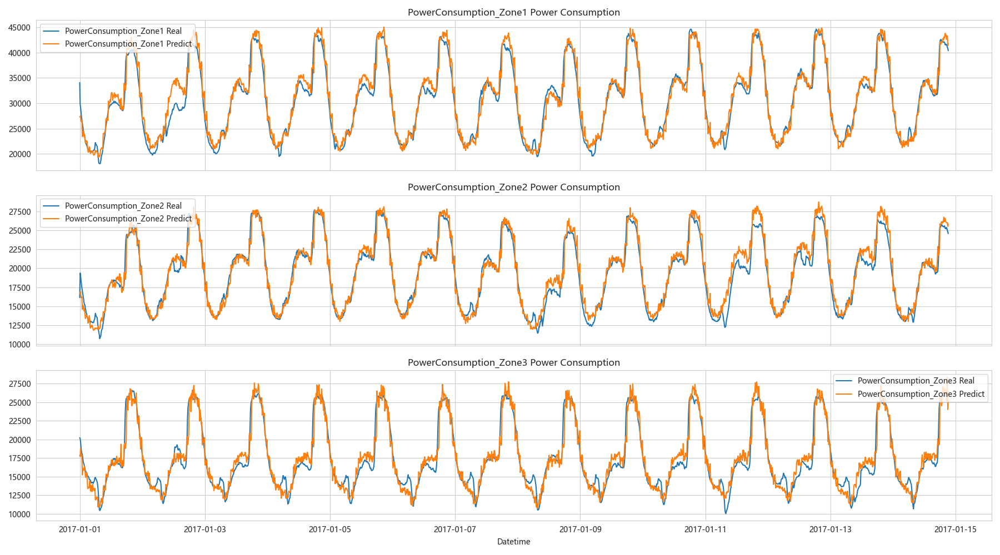

# **电力预测生成模型：CVAE电力消耗预测** ⚡🔮

[](https://www.python.org/) [](https://pytorch.org/) [](LICENSE) [](https://github.com/yourusername/power-cvae-prediction)

---

## **📖 项目概述**

这是一个基于**条件变分自编码器（CVAE）**的**电力消耗预测与生成**项目，专为多区域时序数据设计。模型能捕捉**条件依赖**（如时间、区域权重），生成带**不确定性**的预测分布，适用于智能电网峰荷预警、能源优化等场景。🚀

* **核心创新**：结合变分推理捕捉多模态分布，避免传统LSTM的刚性预测。
* **数据集**：基于2017年摩洛哥北部一城市3个区域电力消耗时序数据（Zone1/2/3）。
* **目标**：实现高精度时序拟合（R² > 0.9），并量化95%置信区间（CI）。

项目结果显示模型**收敛良好**，分布匹配优秀，适合实际部署！😊

---

## **🎯 功能亮点**

* **多区域支持**：加权处理Zone1、Zone2、Zone3。
* **不确定性量化**：生成带CI的预测序列，覆盖率>95%。
* **评估全面**：MSE损失、分布直方图、时序线图、残差QQ图等可视化。
* **易扩展**：集成天气/季节条件，提升长周期预测。

---

## **🛠️ 环境安装**

确保Python 3.10+环境，然后一键安装依赖：

```bash
# 克隆项目
git clone https://github.com/gaigai2002/EnergyForcasting-CVAE.git
cd EnergyForcasting-CVAE

# 创建虚拟环境（推荐）
python -m venv venv
source venv/bin/activate  # Linux/Mac
# 或 venv\Scripts\activate  # Windows

# 安装依赖
pip install -r requirements.txt
```

**硬件要求**：GPU推荐（NVIDIA CUDA 11+），CPU也可运行小型数据集。

---

## **📊 实验结果**
### **预测准确性**
{width=80%}

---

*最后更新：2025-10-20* 
